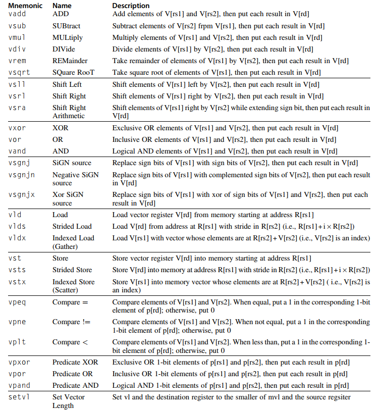

# A Single Cycle RV32IMV

## Vector instructions
The vector extension of RV32 is being draft.  
We don't implement the Floating-point version for both vector and scalar instructions.

  
*The vector instructions that I implemented. All are R-type.  
Source: **Computer Architecture: A Quantitative Approach, 6th edition***

Our vector architecture supports *dynamic register typing*.  
Dynamic register typing lets programs disable unused vector registers.